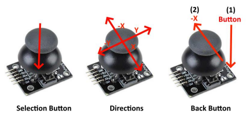
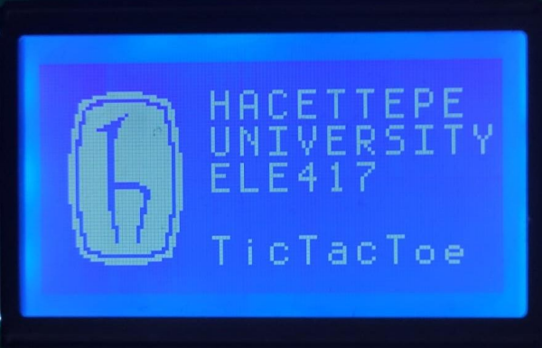
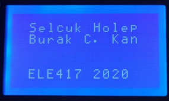
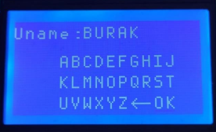
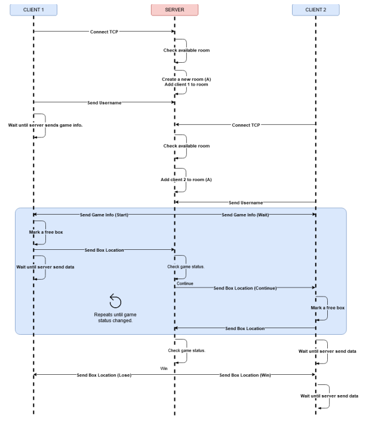
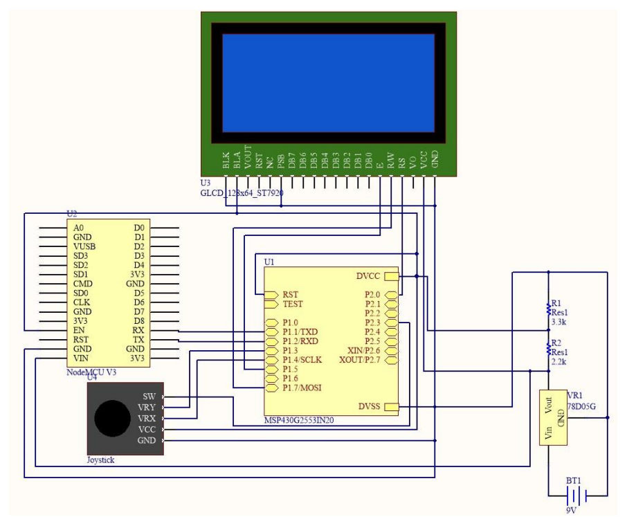
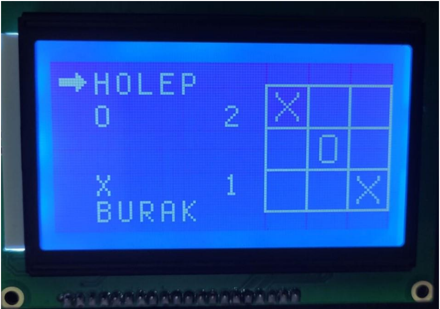
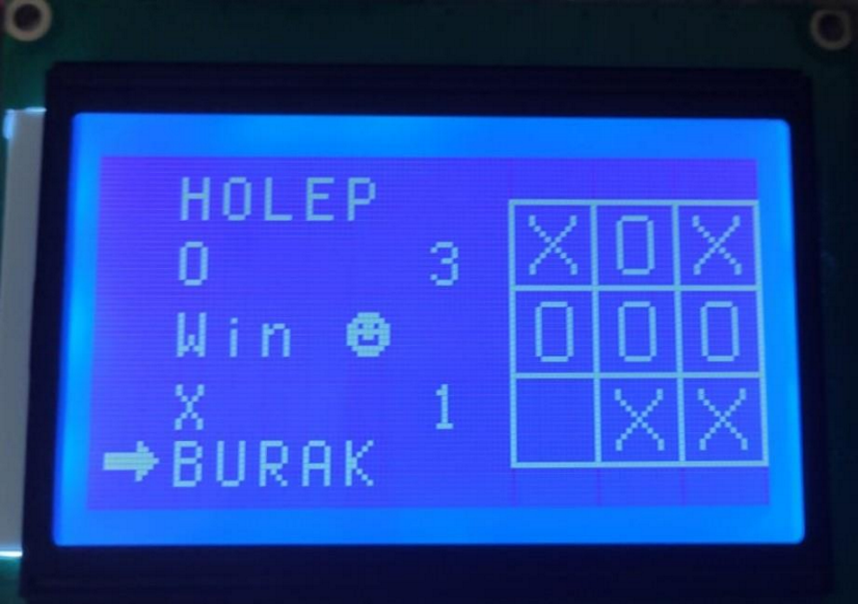

## Introduction

Tic Tac Toe is a game which is widely known for years. This game is played with two players. There  are nine empty boxes which are located as 3x3 grid in a board. Also, there are two symbols which are  ‘X’ and ‘O’. The symbols are distributed to players randomly, then game starts. The first player puts  his/her symbol in one of the empty boxes. Then, second user plays. The game continues until all  boxes are fully marked or one of the symbols is sequentially same in a row, a column, or a diagonal. If  the boxes are fully marked and no symbols are sequentially same, then the round is finished without  win. Otherwise, the player who owns the symbol wins the round.

The traditional way of playing of this game is that use a paper as a board and a pen to marking. On the other hand, with the development of technology, this game is played remotely like many other  games. The main difference of traditional and modern way of playing there needs to be two screens and two markers (keyboard, joystick, vs.) and a shared server.

In this project, the tic-tac-toe game is written by using MSP430 microcontroller.

## Methods

### Components

#### Hardware

1. **Microcontroller** (MSP430G2553) x2
   - Master clock speed: 8Mhz.
   - Serial communication: **SPI** (MOSI), **UART**.
   - Interrupt: **TimerA**, **ADC**.
2.  **Joystick** x2
3. **128x64 GLCD** (ST7920) x2
   - Communication: **SPI**
   - Baud rate: **115200 Hz**
4. **Wi-Fi Module** (ESP8266) x2
   - Communication: **UART**
   - SDK version: **3.0.4**
   - AT version: **1.7.4.0**
   - Baud rate: **9600 Hz**

#### Software

1. **TCP Client** (C++)
2. **TCP Server** (Nodejs)

#### Development Environment (IDE)

1. Code Composer Studio
2. WebStorm

### Development Steps

There are many hardware components to develop tic-tac-toe game. It is hard to merge them without  class-based structure. So, the classes (libraries) are written one by one. The steps are explained  below.

#### Joystick

A joystick library is written. The joystick has two analogue pins to measure X and Y locations.  Also, there is a digital pin which is controlled by a button.

The joystick is needed to enter a username on a virtual keyboard, navigate in the game,  mark the symbol. When navigating, it is necessary to return up menu. After determined these  features, it is written three events which are handled by ADC and button status. There events are  explained below:

1. **Direction changed:** If joystick direction is changed by user, this event informs the listener with changed direction.
2. **Button pressed:** If button on joystick is pressed, this event informs the listener.
3. **Back pressed:** Actually, there is only one button in a joystick, so it is not possible to define  anything as a back pressed controller. In this library, this back press action is implemented  using a gesture which is pressing the joystick then pulling it to the left. So, if this action is  detected, the listener is informed by the event.

**UML** for Joystick:

- **init()**: Initializes ADC and sets button pin.
- **controlADC():** Checks new ADC values, then decides direction is changed.
- **controlButton():** Checks button is pressed up or down.
- **onDirectionChanged(callback):** Takes an address of a void, then calls back if a direction is changed.
- **onButtonPressed(callback):**  Takes an address of a void, then calls back if joystick button pressed.
- **onBackPressed(callback):** Takes an address of a void, then calls back if back action is detected.

#### Graphical LCD (128x64)

A graphical lcd (128x64) which has controller ST7920 is written. The communication  between microcontroller can be parallel or series(SPI). In this project, the series communication is  used. There are mainly two processes which are sending data and sending a command to lcd. These  instructions are explained in ST7920 datasheet. By executing main processes, the functions  (**printString**, **drawImage**, **etc..**) are written.

**UML** for ST7920:

- **fillScreen(pattern)**
- **fillRectangle(pattern, x, y, width, height)**
- **printString(string, x, y)**
- **blinkString(string, x, y, times)**
- **drawImage(image, x, y, width, height)**

 

 

#### Wifi Module(ESP8266)

ESP8266 uses UART to communicate with  microcontroller. Before writing library, the ESP8266 is updated last version. Then configured its baud  rate from 115200 to 9600. The reason of changing baud rate is that reducing the error rates both  receiving and transmitting.

he library has two events which are *onReceivedStringBetweenBrackets* and *onDetectedStatus*:

- **onReceivedStringBetweenBrackets:** When a string or a char between brackets (server always send data between brackets.), call  backs to program.
- **onDetectedStatus:** When the `OK` ; `ERROR` , `CLOSED` are received from UART, the function informs that the  listener.

**UML** for ESP8266:

- **connectWifi(ssid, pwd)**
- **connectTCP(ip, port)**
- **disconnectTCP()**
- **sendToServer(data)**
-  **controlRX()**
- **onReceivedStringBetweenBrackets()**
- **onDetectedStatus()**

After creating these libraries, these all merged and started to develop Tic-Tac-Toe client. 

In this client, there is a pagination to navigate between menu, game, message box etc.

Initially, the intro shown on screen for approximately 3 seconds. Then, active page is  changed to menu. After choosing the `find a match` then, the virtual keyboard is shown. By  using joystick, it can be written a username. After entering username, the client tries to connect to  server. If it is connected successfully, the client sends its username to server then starts to wait until server sends game info to client. The detailed server-client communication is shown below.

### Final Design

The final game model’s images are shown below:

#### Demo

You can watch the demo video: https://youtu.be/Xtv0rR88f-k

### Contributors

- Selçuk Holep [@sholep](https://www.linkedin.com/in/sholep/)
- Burak Celal Kan [@burakcelalkan](https://www.linkedin.com/in/burak-celal-kan/)

